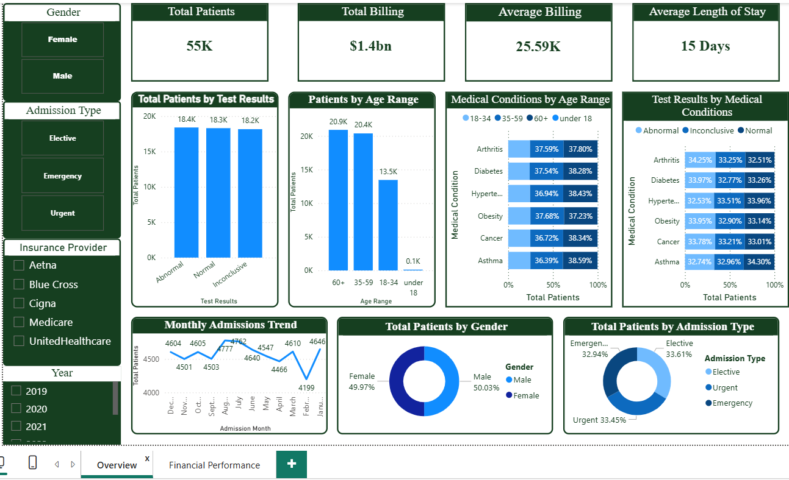
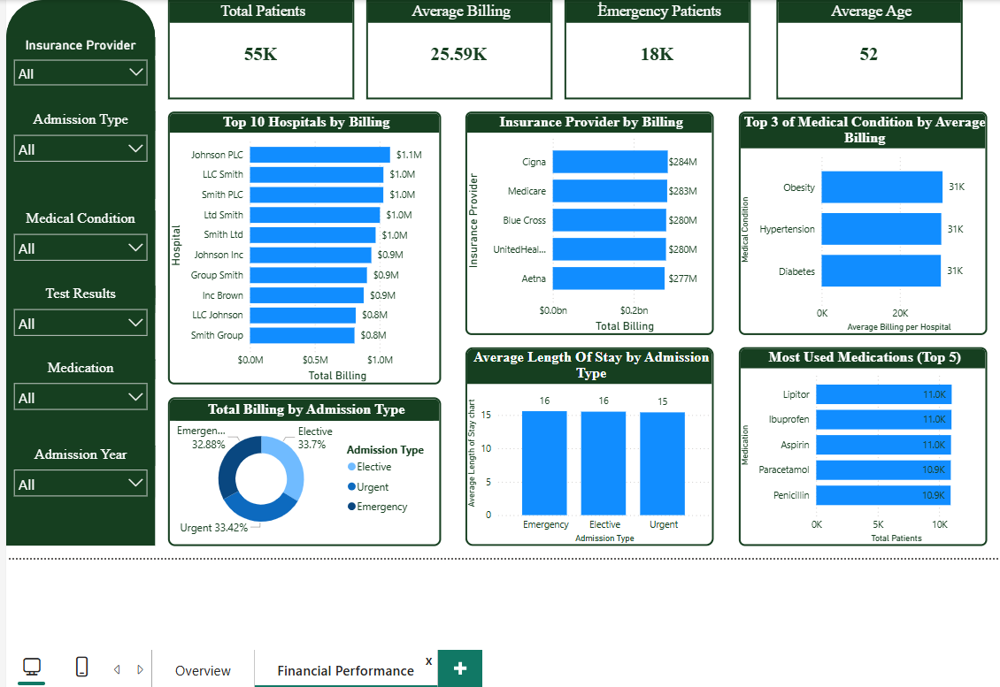

# Healthcare & Hospital Performance Dashboard

## Project Overview

This project presents an interactive Power BI dashboard designed to analyze healthcare and hospital performance data.

The dashboard provides insights into patient demographics, admissions, billing performance, insurance providers, medical conditions, medications, and test results.

---

## Tools Used

- Power BI
- Power Query
- DAX
- Data Cleaning
- Data Visualization

---

## Dataset

The dataset contains healthcare records including:

- Patient information
- Age and gender
- Medical conditions
- Admission type
- Insurance provider
- Billing amount
- Medication
- Test results
- Admission and discharge dates

---

## Data Cleaning & Transformation

The data was cleaned and transformed using Power Query.

Main steps included:

- Removed duplicate rows
- Checked and corrected data types
- Created Age Range column
- Created Admission Year and Admission Month columns
- Created Length of Stay column
- Cleaned and standardized text fields

---

## DAX Measures

Key measures created:

- Total Patients
- Total Billing
- Average Billing
- Emergency Patients
- Emergency Rate
- Average Length of Stay
- Abnormal Test Rate

---

## Dashboard Pages

### 1. Overview
Provides a high-level summary of total patients, billing, average billing, length of stay, admission trends, and test results.

### 2. Financial Performance
Analyzes billing by insurance provider, top hospitals by billing, admission type billing, and medical conditions by average billing.

---

## Key Insights

- The dashboard helps identify the most common medical conditions.
- It highlights billing trends by insurance provider and admission type.
- It shows patient distribution by gender, age range, and test results.
- It supports better understanding of healthcare operations and financial performance.

---

## Dashboard Preview

Add your screenshots in the `dashboard-screenshots` folder and update the file names below.

